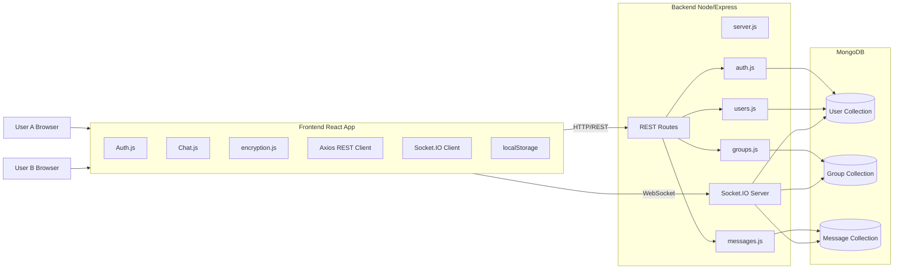
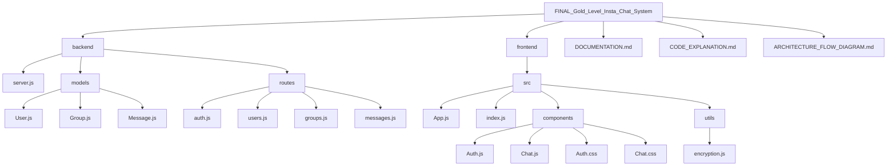
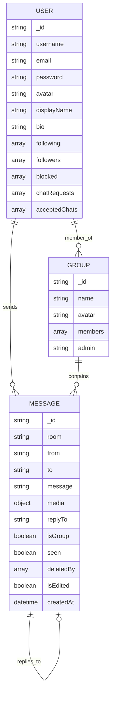
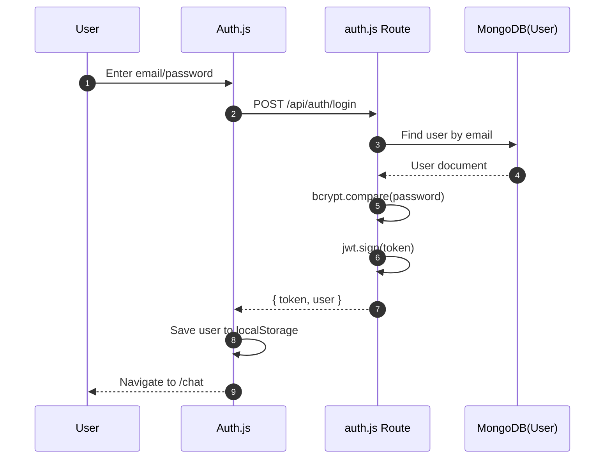
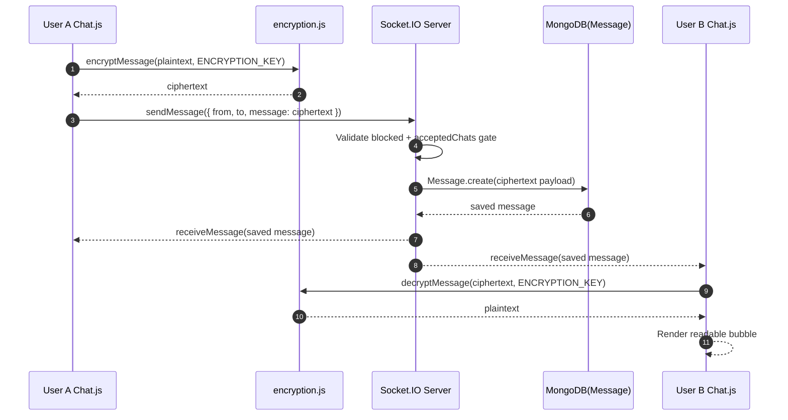
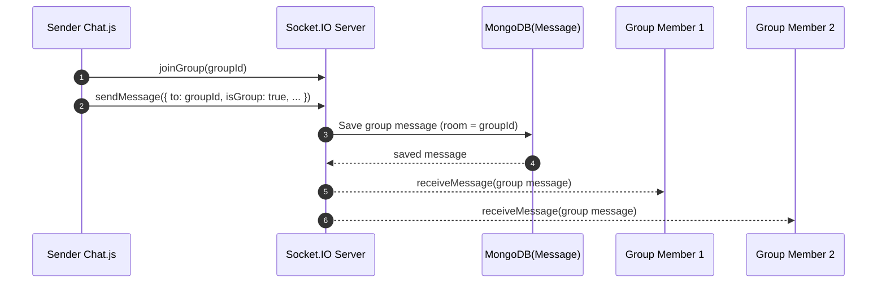
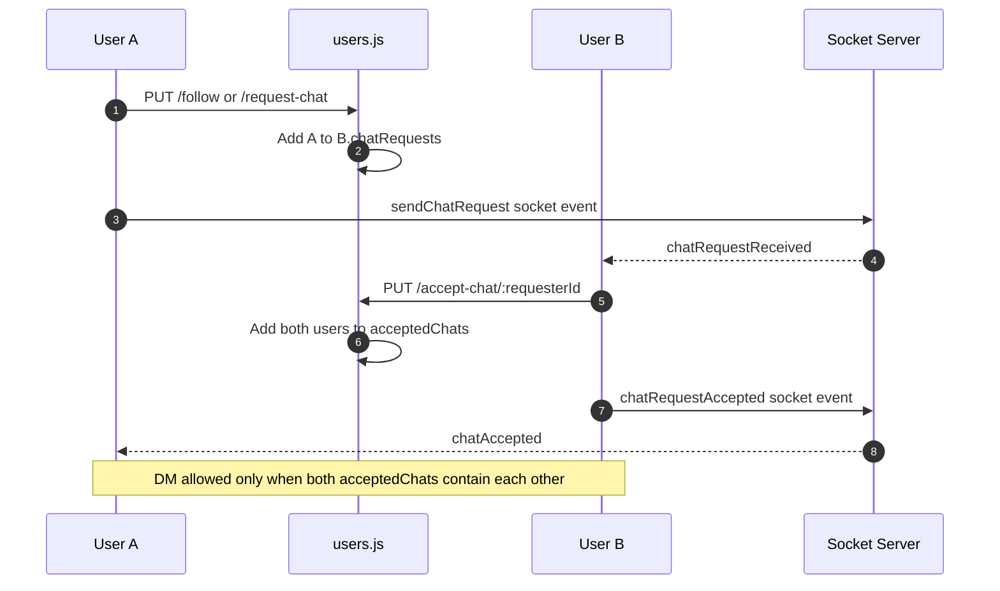
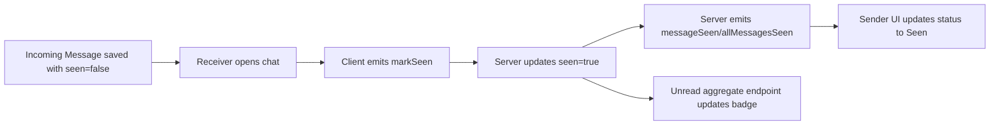
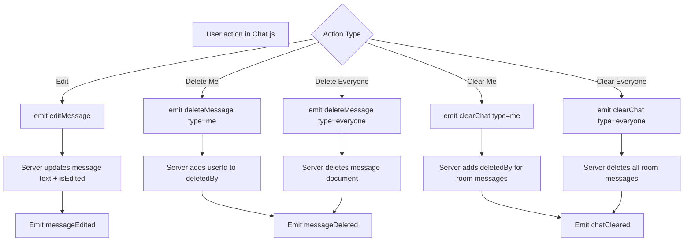
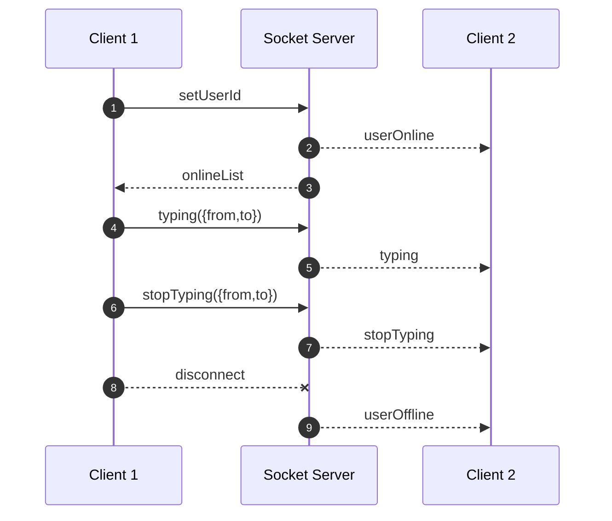

# Insta Chat System Architecture and Complete Data Flow

This file provides complete architecture diagrams and full data flow for the current working system.

## 1. High-Level Architecture

## 2. Repository Structure Diagram

## 3. Data Model Relationship Diagram

## 4. Authentication Flow

## 5. Direct Message Flow (Encrypted)

## 6. Group Message Flow

## 7. Chat Request and DM Gating Flow

## 8. Seen/Unread Data Flow

## 9. Message Edit/Delete/Clear Flow

## 10. Presence and Typing Flow

## 11. Where Encryption Happens Exactly

- Encrypt before send: frontend/src/components/Chat.js -> send()
- Encrypt before edit emit: frontend/src/components/Chat.js -> submitEdit()
- Decrypt on live receive: frontend/src/components/Chat.js -> socket receiveMessage handler
- Decrypt on history fetch: frontend/src/components/Chat.js -> openChat()
- Decrypt on edited message event: frontend/src/components/Chat.js -> messageEdited handler

Important: backend does not decrypt message body anywhere; it stores and forwards encrypted data.

## 12. Full End-to-End Summary

1. User authenticates and enters chat.
2. Frontend loads lists/history via REST and connects socket.
3. User sends encrypted message.
4. Server validates social rules and persists message.
5. Server emits message events in real-time.
6. Receiver decrypts and displays plaintext.
7. Seen, unread, typing, online states keep both clients synchronized.
8. Optional operations (reply, media, edit, delete, clear) flow through dedicated socket handlers and database updates.
